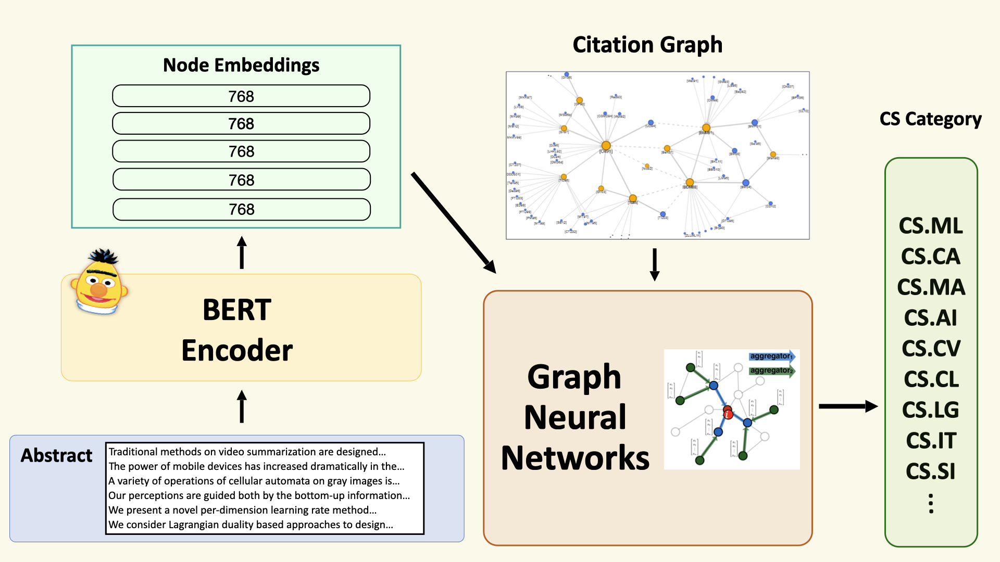

# Multi-class Classification with fine-tuned BERT &amp; GNN

## Overview

BERT is the most powerful neural networks model in NLP area. Graph Neural Networks(GNN) is also one of the most popular model now. 
Therefore, we want to bring the advantages in BERT to the citation network, and evaluate that how much improvement can BERT help GNN models work.

In this repository, we will explore the use of fine-tuned BERT, how to encode node features using BERT model, 
and using citation graph and node features to train GNN models. 

**Now, it just support Pytorch framework!**

The step is as follows:

1.  Download `ogbn-arxiv` dataset from [Open Graph Benchmark](https://ogb.stanford.edu/).
2.  Fine-tuned BERT with arxiv dataset and select the model which has the best accuracy in validation set as encoder.
3.  Encode the node features using fine-tuned BERT.
4.  Train and evaluate the GNN model.

You can see the details about how to train the code in `pytorch` and `tensorflow` directory.

## Colab Tutorials
We've also created the following hands-on colab tutorials in `pytorch` and `tensorflow`
that will allow you to get start faster:

*   [Pytorch](https://github.com/joshchang1112/bert_gnn_arxiv/blob/master/pytorch/fine_tuned_bert_gnn_pytorch.ipynb)

## Experiments

The experiments below are from this repo and Open Graph Benchmark Leaderboard. 

All the results are the average at least over 10 runs.
Model   |  Test Accuracy  | Validation Accuracy | Hardware |
:-----: | :-------------:| :-------------:| :-------------:|
GCN   (official, Rank 27 in Leaderboard) | 0.7174 &pm;   0.0029 | 0.7300 &pm; 0.0017 | GeForce RTX 2080   (11GB GPU)
GAT+label reuse+self KD   (official, **Rank 1** in Leaderboard) | **0.7416** &pm;   0.0008 | 0.7514 &pm; 0.0004 | GeForce RTX 2080Ti   (11GB GPU)
GCN (this repo.)    |  0.7189 &pm;   0.0020 | 0.7310 &pm; 0.0009   | GeForce RTX 2070   (8GB GPU)
Fine-tuned BERT    |  0.7204 &pm;   0.0034   | 0.7324 &pm; 0.0019   |  GeForce RTX 2070   (8GB GPU)
Fine-tuned BERT+GCN   (**Beat Rank 1!**) |   **0.7487** &pm;   0.0026 | 0.7630 &pm; 0.0007   | GeForce RTX 2070   (8GB GPU)

## Concat information
For help or issues using our code, please contact Sung-Ping Chang (`joshspchang@gmail.com`).
